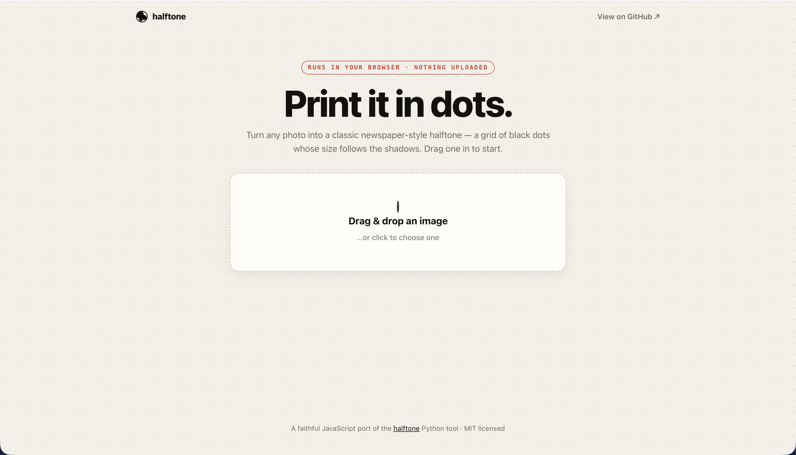
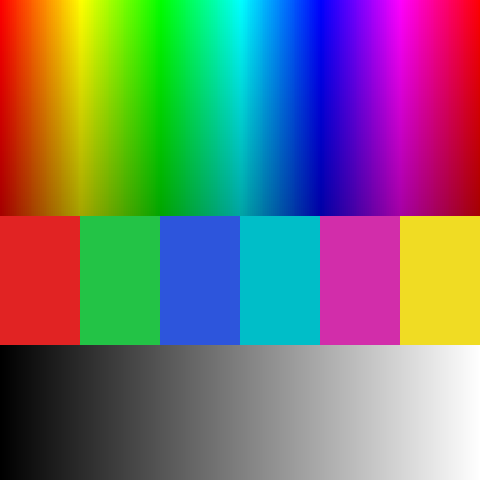
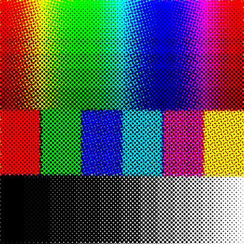

# halftone

Turn images into classic newspaper-style **halftone** prints — the look where
continuous gray tones are reproduced as a grid of black dots whose *size* varies
with darkness. Big dots in the shadows, tiny dots in the highlights; from a
distance your eye blends them back into smooth tone.

This is the same trick printing presses used for over a century to put
photographs on paper.

It also renders full-color **CMYK** process halftones — four ink screens
(cyan, magenta, yellow, black) at the classic rosette angles — as a visual
simulation of how four-color printing reproduces a photograph.

**[Try it in your browser →](https://trolzie.github.io/halftone/)** — drag in an
image, tune the screen with live sliders, download the result. Runs entirely
client-side; nothing is uploaded.

[](https://trolzie.github.io/halftone/)

## See it

| Original | Halftone |
| --- | --- |
|  |  |

### Variations

The screen is fully tunable. A few of the looks you can get:

| `--invert` (white ink on black) |
| --- |
|  |

### Color (CMYK)

With `--color`, the image is separated into cyan, magenta, yellow and black
screens at rosette angles and composited back to RGB:

| Source | CMYK halftone (`--color`) |
| --- | --- |
|  |  |

## Install

```bash
pip install -e .
```

Requires Python 3.9+. Depends on [Pillow](https://python-pillow.org/) and
[NumPy](https://numpy.org/).

## Command-line usage

```bash
# Simplest form — writes photo_halftone.png next to the source
halftone photo.jpg

# Choose an output path and a finer screen (smaller dots)
halftone photo.jpg -o out.png --cell-size 4

# Coarse, gritty newspaper look
halftone photo.jpg --cell-size 12

# White dots on black paper
halftone photo.jpg --invert

# Full-color CMYK process halftone (RGB output)
halftone photo.jpg --color
```

| Option | What it does |
| --- | --- |
| `-o, --output` | Output path (default: `<input>_halftone.png`). |
| `-c, --cell-size PX` | Dot spacing in source pixels. Smaller = finer screen. |
| `-s, --scale` | Supersampling factor for smooth dot edges. |
| `-a, --angle DEG` | Screen angle in degrees (45 is traditional; monochrome only). |
| `-g, --gamma` | Tone curve; `>1` lightens midtones, `<1` darkens. |
| `--max-dot` | Max dot diameter as a multiple of cell size. |
| `--invert` | White ink on black paper (monochrome). |
| `--color` | Four-color CMYK process halftone (RGB output). |
| `--gcr` | Color: gray-component replacement `0`–`1`. Lower keeps richer CMY shadows. |
| `--cmyk-angles C M Y K` | Color: the four rosette screen angles (default `15 75 0 45`). |

## Library usage

```python
from PIL import Image
from halftone import halftone, HalftoneConfig

src = Image.open("photo.jpg")
out = halftone(src, HalftoneConfig(cell_size=6, angle=45))
out.save("photo_halftone.png")
```

For color, `halftone_cmyk()` returns an `"RGB"` image:

```python
from PIL import Image
from halftone import halftone_cmyk, HalftoneConfig

out = halftone_cmyk(Image.open("photo.jpg"), HalftoneConfig(cell_size=6))
out.save("photo_color.png")
```

`halftone()` always returns a grayscale (`"L"`) image and `halftone_cmyk()` an
`"RGB"` image, both the same size as the input.

## How it works

1. Convert the image to grayscale.
2. Rotate it to the **screen angle** (45° by default — the angle least
   noticeable to the human eye for a single-colour screen).
3. Walk a grid of `cell_size`-pixel cells. For each cell, measure the average
   darkness and draw one black dot at its center. The dot's **area** is made
   proportional to the darkness (so its diameter scales with `√darkness`),
   because area is what your eye actually integrates.
4. Dots are drawn on a **supersampled** canvas and shrunk back down, which gives
   them smooth, anti-aliased edges.
5. Rotate back and crop to the original frame.

`max_dot` lets dots in the shadows grow past their cell and overlap, so dark
regions fill in to solid ink — exactly as ink dots gain on real paper.

### Color (CMYK)

`halftone_cmyk()` extends the same idea to four-color process printing:

1. Separate the image into **cyan, magenta, yellow and black** ink channels.
   Black is generated explicitly (gray-component replacement, the `gcr` knob),
   so neutrals and shadows print on the black screen instead of a muddy C+M+Y
   overprint.
2. Screen each channel independently at its own **rosette angle** (15°, 75°, 0°,
   45° by default — the 30° separations stop the screens beating into moiré, and
   yellow takes 0° because it's the least visible ink).
3. Composite the four screens back to RGB with a subtractive (multiply) model,
   so overlapping dots darken and mix into the rosette.

This is a *visual simulation* of how a CMYK press reproduces a photograph,
composited in ordinary sRGB so it views correctly everywhere (and matches the
browser version). It is not color-managed prepress output — there is no ICC
profile or paper/ink model.

## Examples

Regenerate the sample images with:

```bash
python examples/generate_demo.py
```

This writes a synthetic `source.png` plus fine/coarse/0°-angle renderings into
`examples/`.

## Development

```bash
pip install -e ".[dev]"
pytest
```

## License

[MIT](LICENSE)
